# BTF Robot Repository — Full Documentation
> NYU ROB-GY 6213: Robot Navigation & Localization  
> Authors: Jotheesh Kummathi, Long Quang

---

## Table of Contents
1. [What This Repo Is](#what-this-repo-is)
2. [Repository Structure](#repository-structure)
3. [High-Level System Architecture](#high-level-system-architecture)
4. [Data Flow (Runtime)](#data-flow-runtime)
5. [Module Dependency Graph](#module-dependency-graph)
6. [Arduino Firmware](#arduino-firmware-robot_arduino_codeino)
7. [Python Modules Deep Dive](#python-modules-deep-dive)
   - [parameters.py](#parameterspython)
   - [robot.py](#robotpy)
   - [motion_models.py](#motion_modelspy)
   - [extended_kalman_filter.py](#extended_kalman_filterpy)
   - [data_handling.py](#data_handlingpy)
   - [calibrate.py](#calibratepy)
   - [robot_gui.py](#robot_guipy)
8. [EKF Math — How It Works](#ekf-math--how-it-works)
9. [Control Loop Flow](#control-loop-flow)
10. [Calibration System](#calibration-system)
11. [🚨 Issues & Bugs Found](#-issues--bugs-found)

---

## What This Repo Is

This is the software stack for a **small 4-wheeled Ackermann robot** used in the NYU ROB-GY 6213 course. The robot has:
- An **Arduino-based microcontroller** that drives motors, reads encoders, and talks to a LiDAR
- A **Python laptop application** that:
  - Remote controls the robot over WiFi (UDP)
  - Estimates the robot's pose using an **Extended Kalman Filter (EKF)**
  - Visualizes sensor data and trajectories in a browser-based **NiceGUI** dashboard
  - Calibrates motion model parameters from logged trial data

Labs build up from basic bring-up → motion modeling → EKF → particle filter → autonomous navigation.

---

## Repository Structure

```
btf-robot/
├── configs/
│   ├── calibrate_base.json        # Calibration trial definitions + distances
│   └── robot-gui.service          # Systemd service file (for headless Pi)
├── data/
│   ├── data_straight/             # ~78 logged .pkl trial files
│   └── robot_data.pkl             # Legacy single data file
├── docs/                          # Lab writeup docs + assets
├── src/
│   ├── robot_arduino_code/        # Arduino (.ino) + RPLidar driver
│   └── robot_python_code/         # All Python modules (the main codebase)
│       ├── parameters.py          # Centralized config constants
│       ├── robot.py               # Robot class + UDP + DataLogger
│       ├── motion_models.py       # Ackermann kinematic model
│       ├── extended_kalman_filter.py  # EKF prediction + correction
│       ├── data_handling.py       # File I/O + plotting helpers
│       ├── calibrate.py           # Encoder + steering calibration
│       ├── robot_gui.py           # NiceGUI web dashboard (main entry point)
│       └── calibration_1.py       # (legacy/unused calibration script)
└── tests/                         # check_trials.py, test_gui.py
```

---

## High-Level System Architecture

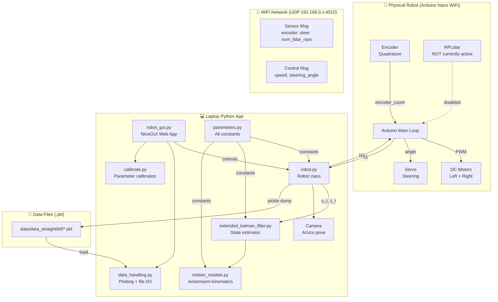

---

## Data Flow (Runtime)

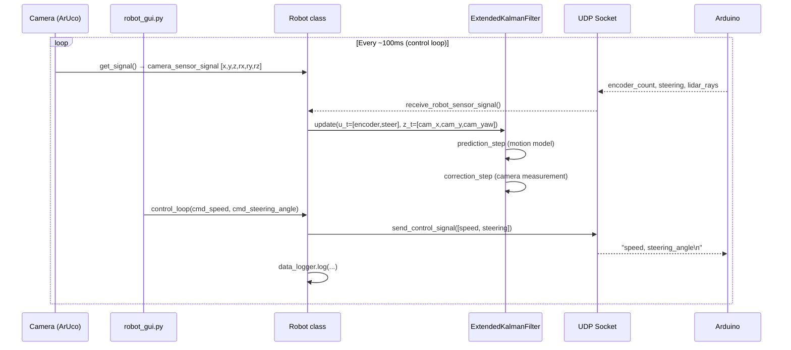

---

## Module Dependency Graph

> [!WARNING]
> There is a **circular import issue** here. [data_handling.py](file:///Users/jotheeshkummathi/Desktop/NYUSA/Semester%204/RLAN/labs/btf-robot/src/robot_python_code/data_handling.py) imports from [robot.py](file:///Users/jotheeshkummathi/Desktop/NYUSA/Semester%204/RLAN/labs/btf-robot/src/robot_python_code/robot.py), and [robot_gui.py](file:///Users/jotheeshkummathi/Desktop/NYUSA/Semester%204/RLAN/labs/btf-robot/src/robot_python_code/robot_gui.py) imports [calibrate.py](file:///Users/jotheeshkummathi/Desktop/NYUSA/Semester%204/RLAN/labs/btf-robot/src/robot_python_code/calibrate.py) which also imports [data_handling.py](file:///Users/jotheeshkummathi/Desktop/NYUSA/Semester%204/RLAN/labs/btf-robot/src/robot_python_code/data_handling.py). See Issues section.

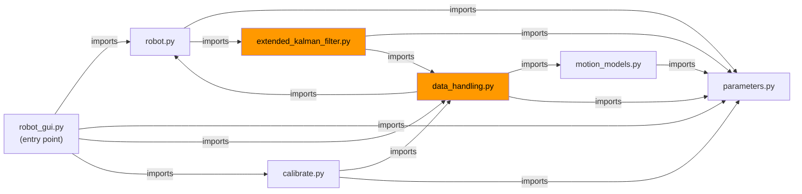

> [!NOTE]
> Orange nodes = files involved in the circular import chain:  
> [robot.py](file:///Users/jotheeshkummathi/Desktop/NYUSA/Semester%204/RLAN/labs/btf-robot/src/robot_python_code/robot.py) → [extended_kalman_filter.py](file:///Users/jotheeshkummathi/Desktop/NYUSA/Semester%204/RLAN/labs/btf-robot/src/robot_python_code/extended_kalman_filter.py) → [data_handling.py](file:///Users/jotheeshkummathi/Desktop/NYUSA/Semester%204/RLAN/labs/btf-robot/src/robot_python_code/data_handling.py) → [robot.py](file:///Users/jotheeshkummathi/Desktop/NYUSA/Semester%204/RLAN/labs/btf-robot/src/robot_python_code/robot.py)

---

## Arduino Firmware ([robot_arduino_code.ino](file:///Users/jotheeshkummathi/Desktop/NYUSA/Semester%204/RLAN/labs/btf-robot/src/robot_arduino_code/robot_arduino_code.ino))

The Arduino code runs a simple loop: **receive → actuate → sense → send**.

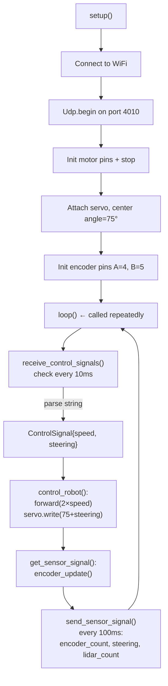

**Key Arduino constants:**
| Constant | Value | Meaning |
|---|---|---|
| `SendDeltaTimeInMs` | 100 ms | How often Arduino sends sensor data |
| `ReceiveDeltaTimeInMs` | 10 ms | How often Arduino checks for commands |
| `NoSignalDeltaTimeInMs` | 2000 ms | Auto-stop if no command received |
| `steering_angle_center` | 75° | Servo center (straight ahead) |
| Left speed multiplier | ×1.25 | Left motor is slower, compensated |
| Right speed multiplier | ×0.95 | Right motor is faster, compensated |

---

## Python Modules Deep Dive

### [parameters.py](file:///Users/jotheeshkummathi/Desktop/NYUSA/Semester%204/RLAN/labs/btf-robot/src/robot_python_code/parameters.py)

The **single source of truth** for all configuration. Everything imports from here.

| Category | Parameter | Value | Meaning |
|---|---|---|---|
| Network | `arduinoIP` | `192.168.0.198` | Arduino WiFi address |
| Network | `localIP` | `192.168.0.196` | Laptop WiFi address |
| Network | `localPort` / `arduinoPort` | `4010` | UDP port |
| Camera | `camera_id` | `0` | OpenCV camera index |
| Camera | `marker_length` | `0.10 m` | ArUco marker size (100mm) |
| Motion | `counts_to_m` | `3518` | Encoder counts per meter |
| Motion | `wheelbase` | `0.1444 m` | Front-rear axle distance |
| Motion | `track_width` | `0.150 m` | Left-right wheel distance |
| Motion | `wheel_radius` | `0.034 m` | Drive wheel radius |
| Motion | `max_steer_deg` | `20°` | Max steering angle |
| Motion | `steering_to_w` | `0.0024` | Steering cmd → rad/s |
| Noise | `distance_variance_a` | `0.0001` | Base variance for distance |
| Noise | `distance_variance_b` | `0.01` | Scaling factor for distance variance |
| KF | `I3` | 3×3 identity | Used for initial EKF covariance |
| Logging | `datapath` | `data/data_straight/btf/` | Where .pkl files go |
| Trial | `trial_time` | `5000 ms` | Length of a logging trial |
| Trial | `trial_max_speed` | `40` | Speed during a trial |

---

### `robot.py`

Contains all the hardware communication classes:

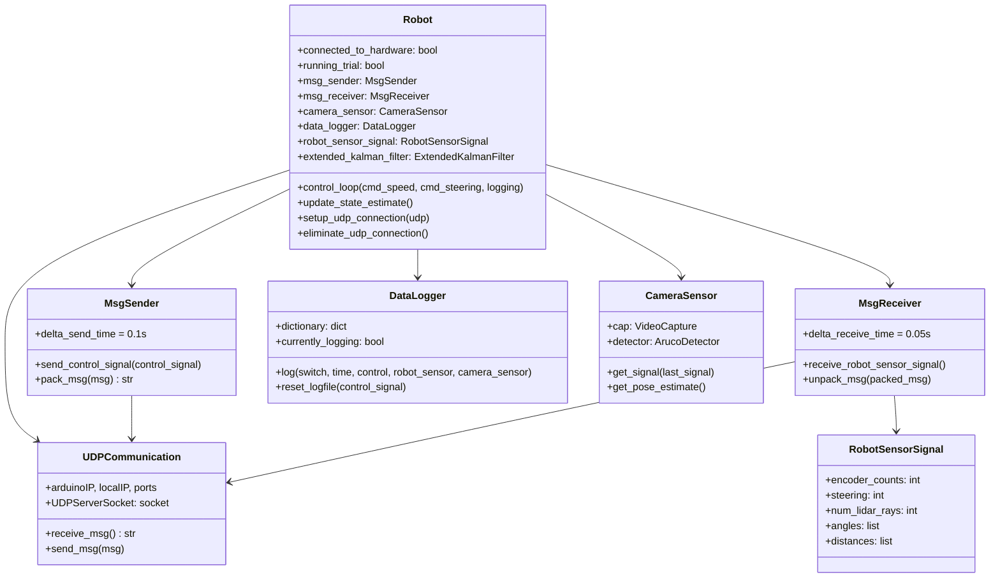

**Logged data format** (saved as `.pkl` files):
```
{
  'time':                 [float, ...]           # perf_counter timestamps
  'control_signal':       [[speed, steer], ...]
  'robot_sensor_signal':  [RobotSensorSignal, ...]
  'camera_sensor_signal': [[tx,ty,tz,rx,ry,rz], ...]
  'state_mean':           [[x,y,theta], ...]
  'state_covariance':     [3×3 matrix, ...]
}
```

---

### `motion_models.py`

Implements the **Ackermann kinematic model** used to predict where the robot goes.

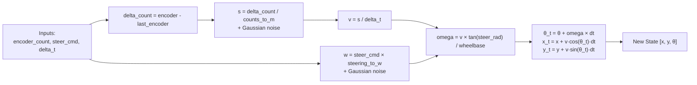

> [!NOTE]
> The motion model adds **stochastic noise** (Gaussian) to both distance and angular velocity at every step. This is used in `traj_propagation` and `generate_simulated_traj` for sampling. The EKF does NOT use this class — it re-implements the same math internally.

---

### `extended_kalman_filter.py`

The EKF is the core algorithm for **pose estimation** (localization).

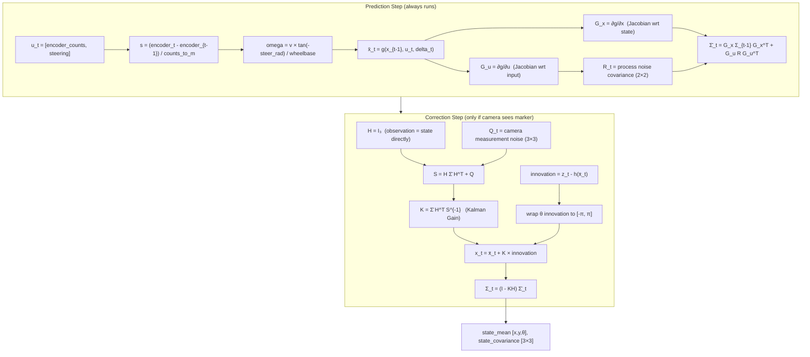

**EKF noise matrices:**
| Matrix | Diagonal values | Meaning |
|---|---|---|
| R (process) | `[0.0001, 0.01]` | Variance in distance [m²] and angular velocity [rad²] |
| Q (measurement) | `[0.01, 0.01, 0.05]` | Camera variance in x [m²], y [m²], theta [rad²] |

---

### `data_handling.py`

Utility module for **loading `.pkl` trial files and plotting**.

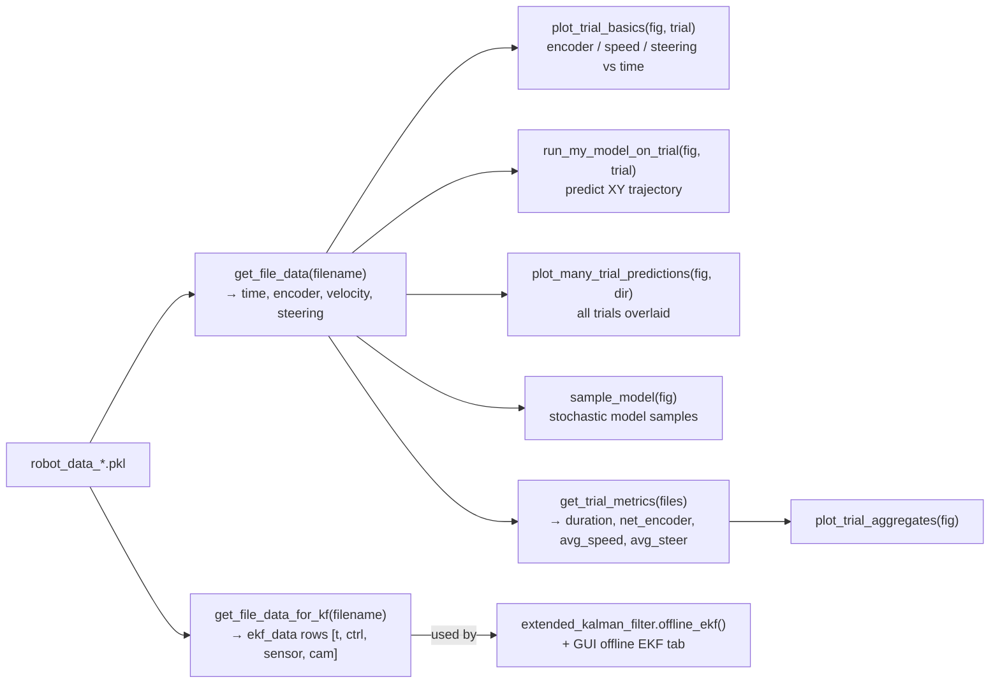

> [!IMPORTANT]
> The bottom of `data_handling.py` (lines 432–500) contains **module-level executable code**: hardcoded file lists (`files_and_data`), and `if False:` blocks containing old test code. These run on every import. The `if False:` blocks are harmless but make the file messy.

---

### `calibrate.py`

Computes calibration parameters from trial data.

```mermaid
flowchart TD
    subgraph ENC["Encoder Calibration"]
        E1["Load encoder_trials from calibrate_base.json"]
        E2["For each trial:<br/>encoder_change = |encoder_end - encoder_start|<br/>counts_to_m = encoder_change / distance_m"]
        E3["Mean counts_to_m across trials"]
        E4["Outlier detection (z-score > 1.2)"]
        E5["Fit variance: σ² = a + b×encoder_counts<br/>(linear regression)"]
        E6["Save: counts_to_m, distance_variance_a, distance_variance_b"]
        E1 --> E2 --> E3 --> E4 --> E5 --> E6
    end

    subgraph STEER["Steering Calibration"]
        S1["Load steering_trials from calibrate_base.json<br/>(hardcoded avg_steering_cmd, measured_yaw, total_time)"]
        S2["angular_velocity = measured_yaw_rad / total_time"]
        S3["steering_to_w = Σ(alpha×w) / Σ(alpha²)<br/>(weighted least squares through origin)"]
        S4["Fit variance: σ² = a + b×|steering_cmd|"]
        S5["Save: steering_to_w, steering_variance_a, steering_variance_b"]
        S1 --> S2 --> S3 --> S4 --> S5
    end
```

> ⚠️ Steering calibration does NOT use log files — all data is hardcoded in `calibrate_base.json`.

---

### `robot_gui.py`

The main entry point — a **NiceGUI web dashboard** running at `http://localhost:8080`.

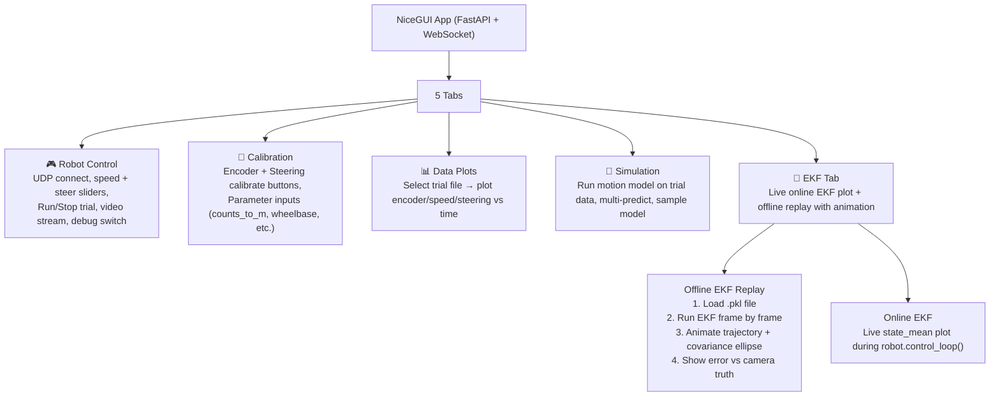

---

## EKF Math — How It Works

The state vector is **[x, y, θ]** (position x, y in meters, heading θ in radians).

**State transition (g function):**
```
s = (encoder_t - encoder_{t-1}) / counts_to_m    # distance traveled this step
v = s / delta_t                                    # linear velocity
omega = v × tan(-steer_rad) / wheelbase           # angular velocity (Ackermann)
θ_t = θ_{t-1} + omega × delta_t
x_t = x_{t-1} + v × cos(θ_t) × delta_t
y_t = y_{t-1} + v × sin(θ_t) × delta_t
```

**Observation model (h function):**
```
h(x) = x   (camera directly observes [x, y, θ], so H = I₃)
```

**Camera signal extraction:**
```
z_t = [camera_signal[0], camera_signal[1], camera_signal[5]]
     = [tx, ty, rz]   (translation x, translation y, rotation z = yaw)
```

---

## Control Loop Flow

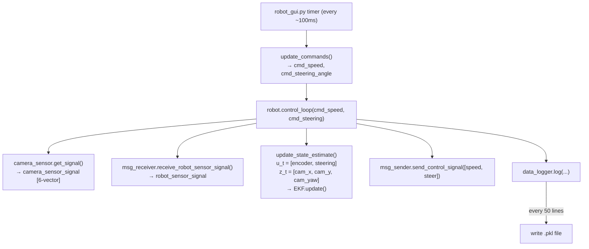

---

## Calibration System

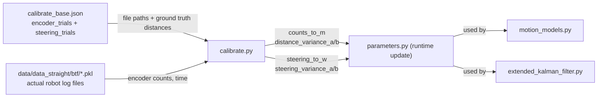

---

## 🚨 Issues & Bugs Found

> [!IMPORTANT]
> None of the code has been changed — these are **observations only**.

### 🔴 Critical / Will Crash

**1. Circular Import** (`extended_kalman_filter.py` ↔ `data_handling.py` ↔ `robot.py`)
- `robot.py` imports `extended_kalman_filter`
- `extended_kalman_filter.py` imports `data_handling`
- `data_handling.py` imports `robot`
- Running `extended_kalman_filter.py` directly as `__main__` causes an `ImportError` because it uses `from robot_python_code import ...` (absolute) while `robot.py` uses `from . import ...` (relative)
- **Fix:** `extended_kalman_filter.py` should not import `data_handling` at the module level — it only uses `data_handling.get_file_data_for_kf` inside the `offline_efk()` function. Move that import inside the function.

**2. `show_localization_plot` references wrong object** (`robot_gui.py`, lines 203–204)
```python
# BUG: uses the MODULE `robot`, not the INSTANCE `robot_instance`
covar_matrix = parameters.covariance_plot_scale * robot.extended_kalman_filter.state_covariance
x_est = robot.extended_kalman_filter.state_mean[0]
```
Should be `robot_instance.extended_kalman_filter...` — or this plot will crash/use wrong data.

**3. `run_trial()` uses `math.abs()` instead of `abs()`** (`robot_gui.py`, line 231)
```python
if math.abs(parameters.trial_input) < parameters.trial_max_speed:
```
`math` has no `abs` method — this is `AttributeError` when `trial_type == "distance"`. Should be just `abs(...)`.

**4. `get_file_data` returns 4 values but `run_my_model_to_predict_state` unpacks 8** (`data_handling.py`, line 269)
```python
# get_file_data() returns 4 values, but this line tries to unpack 8:
time_list, encoder_count_list, velocity_list, steering_angle_list, x_camera_list, y_camera_list, z_camera_list, yaw_camera_list = get_file_data(filename)
```
This function `run_my_model_to_predict_state` will crash if called.

**5. `generate_simulated_traj` always returns immediately** (`motion_models.py`, line 153)
```python
while t < duration:
    t += delta_t
    return t_list, x_list, y_list, theta_list  # ← return inside loop on first iteration!
```
The function always returns after exactly one iteration with empty lists. This is called by `sample_model()` in the GUI's Simulation tab — that tab will just show nothing.

---

### 🟡 Logic / Correctness Issues

**6. Sign flip on steering in EKF vs motion model**
- `extended_kalman_filter.py` line 116: `omega = v * math.tan(-steer_rad) / wheelbase` — **negative** steer
- `motion_models.py` line 101: `omega = v * math.tan(steer_rad) / wheelbase` — **positive** steer
- These model the steering direction opposite ways. One of them is wrong for the physical robot. The EKF and the GUI's Simulation tab will predict trajectories that curve in opposite directions.

**7. `hardcoded absolute path` in `offline_efk()`** (`extended_kalman_filter.py`, line 222)
```python
filename = '/Users/jotheeshkummathi/Desktop/NYUSA/Semester 4/RLAN/labs/btf-robot/...'
```
This only works on one specific person's machine. Should use a relative path or `parameters.datapath`.

**8. `delta_t` hardcoded to 0.1 in live control loop** (`robot.py`, line 314)
```python
delta_t = 0.1
```
The actual loop time varies. Should use `time.perf_counter()` differences for accuracy.

**9. `DataLogger.log()` appends even when `logging_switch_on = False`** (`robot.py`, lines 82–97)
```python
def log(self, logging_switch_on, ...):
    if not logging_switch_on:
        if self.currently_logging:
            self.currently_logging = False
    else:
        ...
    # These always run regardless of the switch:
    self.dictionary['time'].append(time)
    self.dictionary['control_signal'].append(control_signal)
    ...
```
Data is added to the dictionary even when logging is off. The dictionary will grow unboundedly. Only the file write is gated on `currently_logging`. This could cause memory issues on long runs.

---

### 🟢 Minor / Style Issues

**10. Duplicate import** (`robot.py`, line 4 and 12)
```python
from time import strftime   # appears twice at the top
```

**11. Executable code at module level** (`data_handling.py`, lines 432–500)
- The `files_and_data` and `files_and_data_curve` lists are defined at module level and run on every import.
- `if False:` blocks with old plotting code clutter the file.

**12. `calibration_1.py` appears unused** — likely a legacy script from early development.

**13. Missing `save_results` call in `calibrate.py`** — `save_results()` is defined but never called from `calibrate_encoder()` or `calibrate_steering()`. Results only update `parameters` at runtime; they are not persisted to disk unless separately called.

**14. Steering calibration uses hardcoded trial data (no log files)** — all `log_file` fields in the `steering_trials` section of `calibrate_base.json` are empty strings. The steering calibration relies entirely on manually entered values (`measured_yaw_deg`, `average_steering_cmd`, `total_time`) rather than processing actual log files.

---

## Summary Table

| Module | Role | Status |
|---|---|---|
| `parameters.py` | Config constants | ✅ Good |
| `robot.py` | Hardware I/O classes | ⚠️ Minor bugs (import duplicate, logging append) |
| `motion_models.py` | Ackermann kinematics | 🔴 `generate_simulated_traj` broken |
| `extended_kalman_filter.py` | EKF algorithm | ⚠️ Circular import, sign flip issue, hardcoded path |
| `data_handling.py` | File I/O + plotting | 🔴 `run_my_model_to_predict_state` wrong return count |
| `calibrate.py` | Parameter calibration | ⚠️ `save_results` never called |
| `robot_gui.py` | NiceGUI dashboard | 🔴 Wrong object ref, `math.abs()` crash |
| `robot_arduino_code.ino` | Arduino firmware | ✅ Solid, LiDAR disabled intentionally |
